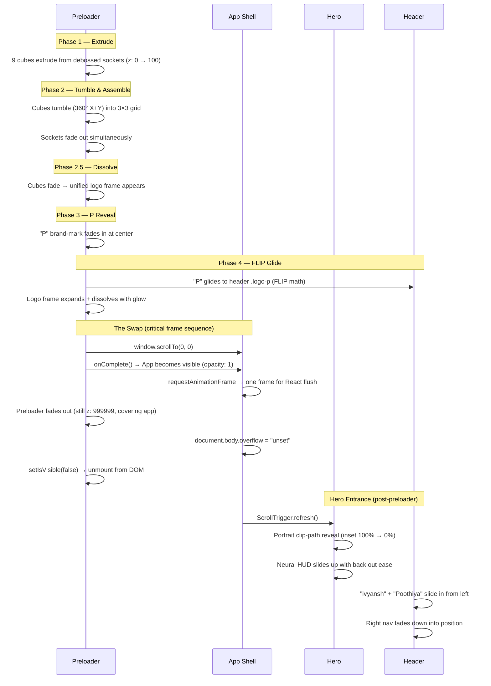

<p align="center">
  
  
  
  
  
  
</p>

# Divyansh Poothiya — AI Portfolio

A high-fidelity, cinematic web portfolio showcasing AI and machine learning engineering projects. Built with a focus on premium motion design, interactive 3D graphics, and performance-first architecture — engineered to deliver an Awwwards-tier visual experience.

> **Live Site →** [priyanshu-upadhyay.netlify.app](https://priyanshu-upadhyay.netlify.app)

---

## ✦ Overview

This isn't a template — it's a custom-built, ground-up portfolio where every interaction, animation, and visual layer is hand-crafted. The site features a multi-phase 3D preloader, scroll-driven cinematic reveals, canvas-based particle physics, and a curated dark-mode design system built on a teal-accented "Moss" color palette.

---

## ✦ Key Features

### 🎬 Cinematic 3D Preloader
A multi-phase "Swarm & Tumble" sequence built entirely with CSS 3D transforms and GSAP:
- **9 cubes** spawn from polar-coordinate "donut" scatter positions and tumble into a 3×3 grid
- Cubes dissolve into a unified logo frame, the "P" brand-mark fades in
- A precision **FLIP glide** animates the preloader "P" to its final position in the site header using center-to-center bounding rect math
- Scroll position is force-reset before the app becomes visible, preventing layout thrash
- Session-aware — only plays once per browser session via `sessionStorage`

### 🖼 Multi-Layer Parallax Hero
A three-layer compositing system inspired by film VFX:
- **Layer 1** — Infinite kinetic marquee typography + topographic SVG contour lines with independent drift tweens
- **Layer 2** — Full-bleed portrait with scroll-driven `clip-path` mask that crops into a portrait card, with a signature SVG drawn stroke-by-stroke using `getTotalLength()` and sorted left-to-right by bounding box
- **Layer 3** — Foreground HUD, scroll cue with zero-gravity float orbits, and a bottom gradient fade for seamless section transitions
- Mouse parallax on every layer at different intensities for true depth perception

### 🧠 Neural Network HUD
A real-time canvas-rendered neural network visualization in the hero section:
- Simulates **forward pass**, **loss computation**, **backpropagation**, and **weight updates** in a continuous loop
- Animated signal propagation along edges with radial gradient glow effects
- Terminal-style readout displaying the current training phase

### 📂 Featured Projects — Interactive Image Gallery
- Framer Motion **spring-physics stack/spread** animation — images fan out into a 2×2 grid on hover
- Full **lightbox** with keyboard-navigable image carousel
- Anti-gravity float effect on stacked images via the custom `useAntiGravity` hook
- Live demo and source links with context-aware icons (external link vs. YouTube play)

### 🃏 Skills — 3D Flip Cards
- Perspective-correct 3D flip with `backface-visibility` and `preserve-3d`
- Cursor-tracking **radial glow** that follows the mouse across the card surface
- Front face shows domain with a background texture; back face reveals a detailed toolkit list
- Timed auto-unflip with hover-interrupt logic

### 🏆 Certifications — Holographic Cards
- Full **6-DOF tilt tracking** (rotateX + rotateY at ±7.5°) following cursor position
- Dynamic **glare layer** that shifts in real-time based on mouse coordinates
- Two-tier layout: holographic AWS badge cards + minor credential cards with progressive focus states

### ✉️ Contact — Vector Space Background
- Full-section **canvas particle physics** — 200 autonomous dots with velocity, boundary wrapping, and inter-dot web connections
- Cursor-reactive connections: lines drawn to mouse position within a 150px radius with distance-based opacity
- **Honeypot anti-spam** security integrated with Netlify Forms
- Glassmorphism form container with teal-accent focus states

### 🦶 Footer — Pulse Wave Particles
- Matches the Contact section's particle density but adds a **traveling pulse wave** that sweeps across the canvas
- Dots and connections brighten as the pulse passes, creating a living, breathing effect
- DPR-aware canvas scaling for crisp rendering on Retina displays

### 🧭 Smart Navigation System
- **Zone-based visibility** — transparent and always visible in the hero, glassmorphism backdrop when scrolled past the hero
- **Accumulated delta logic** — header only re-appears after 50px of sustained upward scroll (prevents jittery accidental reveals)
- Terminal-style **typewriter ticker** in the nav button cycling through section names
- **Bifurcating resume button** — splits into download and preview actions on hover

---

## ✦ Animation Choreography

The site's entrance is a precisely sequenced cinematic pipeline — each phase waits for the previous one to complete before firing. Here's the full orchestration:



### Frame-by-Frame Breakdown

| Phase | Duration | What Happens | Why It Matters |
|---|---|---|---|
| **Extrude** | 1.0s | Cubes rise from sockets with staggered 50ms delay | Creates depth — feels like assembling from nothing |
| **Tumble** | 1.5s | Full 360° rotation on both axes while flying to grid positions | The "wow" moment — kinetic energy meets precision |
| **Dissolve** | 0.5s | Cubes → logo frame crossfade | Transforms chaos into brand identity |
| **P Reveal** | 0.6s | Brand-mark appears over the frame | Focal point before the glide |
| **FLIP Glide** | 1.2s | "P" travels to exact header position via `getBoundingClientRect` delta | Seamless spatial continuity — preloader *becomes* the UI |
| **The Swap** | ~0.4s | App visible → preloader fades → scroll unlocked | 3-frame sequence prevents flash of unstyled content |
| **Hero Entrance** | 1.5s | Portrait wipe + HUD spring-in | Rewards the wait with a cinematic reveal |

### Why This Sequence Matters

The handoff between preloader and app is the hardest part to get right. The challenges solved:

- **Layout thrash prevention** — `window.scrollTo(0, 0)` is called 3 times at different points (before app visibility, after React flush, and after preloader unmount) because browsers and GSAP pin-spacers fight over scroll position
- **FLIP positioning accuracy** — The app must be in the DOM (but invisible) during the preloader so `getBoundingClientRect()` returns correct coordinates for the header's `.logo-p`
- **ScrollTrigger deferred refresh** — If `ScrollTrigger.refresh()` fires while the preloader is still mounted, it calculates wrong pin heights. The refresh is deferred via a `useEffect` that watches `preloaderComplete`
- **Session-aware skip** — On return visits, `sessionStorage` bypasses the entire sequence, and `scrollRestoration` is set to `'auto'` so the browser handles it natively

---

## ✦ Architecture

```
src/
├── App.tsx                   # Root — PreloaderContext, session-aware preloader, React Router
├── main.tsx                  # Entry point
├── index.css                 # Global styles & CSS custom properties
│
├── components/
│   ├── Preloader.tsx         # 3D Swarm & Tumble preloader with FLIP glide
│   ├── Header.tsx            # Smart nav, typewriter ticker, bifurcating resume
│   ├── Hero.tsx              # 3-layer parallax, signature draw, kinetic typography
│   ├── NeuralHUD.tsx         # Canvas neural network visualization
│   ├── About.tsx             # Typewriter roles, portal portrait, clip-path reveal
│   ├── FeaturedProjects.tsx  # Stack/spread gallery, lightbox, anti-gravity float
│   ├── ArchiveLink.tsx       # CTA to full project archive
│   ├── Archive.tsx           # Full project archive page
│   ├── Skills.tsx            # 3D flip cards with cursor-tracking glow
│   ├── Tools.tsx             # Development tools showcase
│   ├── Certifications.tsx    # Holographic 6-DOF tilt cards
│   ├── Contact.tsx           # Vector space canvas, Netlify form, honeypot
│   ├── Footer.tsx            # Pulse wave particles, glassmorphism
│   ├── ScrollToTop.tsx       # Route-change scroll reset
│   └── icons/                # Custom SVG icon components
│
├── hooks/
│   ├── useAntiGravity.ts     # Decoupled GSAP float orbits + rotation
│   └── useSmartNav.ts        # Zone-based header visibility with scroll delta
│
└── lib/
    └── utils.ts              # Utility functions (clsx/twMerge)
```

---

## ✦ Design System

| Token | Value | Usage |
|---|---|---|
| `charcoal` | `#121212` | Primary background |
| `near-black` | `#0a0a0a` | Deep sections (Contact, Certifications) |
| `soft-white` | `#f5f5f5` | Primary text |
| `teal` | `#009394` | Brand accent (borders, focus, interactive) |
| `muted-green` | `#006270` | Subtle accent variant |
| Accent bright | `#00E0C7` | High-emphasis highlights, signature fill |

**Typography**: Inter (Google Fonts) — used across all weights for both body and display.

---

## ✦ Performance Considerations

- **GSAP ScrollTrigger refresh** is deferred until the preloader unmounts, preventing layout recalculation during the entrance sequence
- **Dynamic imports** — `ScrollTrigger` is lazily loaded in `App.tsx` to reduce initial bundle size
- **Canvas animations** use `requestAnimationFrame` with proper cleanup to prevent memory leaks
- **CSS `will-change`** and `transform3d` are used strategically to promote elements to GPU-composited layers
- **Session-aware preloader** skips the animation on return visits, providing instant page loads
- **Debounced resize handlers** on canvas elements prevent layout thrashing during window resize

---

## ✦ Tech Stack

| Layer | Technology |
|---|---|
| **Framework** | [React 18](https://react.dev/) + [TypeScript 5.5](https://www.typescriptlang.org/) |
| **Build Tool** | [Vite 5](https://vitejs.dev/) |
| **Styling** | [Tailwind CSS 3.4](https://tailwindcss.com/) + Custom CSS (3D transforms, animations) |
| **Animation** | [GSAP 3.14](https://gsap.com/) (ScrollTrigger, timelines) + [Framer Motion 12](https://www.framer.com/motion/) |
| **3D Graphics** | [Three.js r158](https://threejs.org/) + [@react-three/fiber](https://docs.pmnd.rs/react-three-fiber) + [@react-three/drei](https://github.com/pmndrs/drei) |
| **Icons** | [Lucide React](https://lucide.dev/) |
| **Routing** | [React Router v7](https://reactrouter.com/) |
| **Deployment** | [Netlify](https://www.netlify.com/) (auto-deploy from Git) |

---

## ✦ Deployment

This project is deployed on **Netlify** with the following configuration:

| Setting | Value |
|---|---|
| Build command | `npm run build` |
| Publish directory | `dist` |
| Dev port | `9999` → `5173` |

The `netlify.toml` handles build settings automatically. An invisible HTML form in `index.html` enables Netlify Forms to detect and process contact submissions without any backend.

---

## ✦ Custom Hooks

### `useAntiGravity`
A reusable hook that applies continuous, organic zero-gravity float animations to any element. Uses GSAP timelines with randomized waypoints and decoupled X/Y + rotation channels for natural-looking motion. Supports pause/resume for hover interactions.

### `useSmartNav`
Manages intelligent header visibility based on scroll position. Implements a two-zone system (hero vs. content) with accumulated scroll-delta logic to prevent jittery reveals, and automatically recalculates thresholds when GSAP pin-spacers shift the layout.

---

## ✦ License

This project is open source and available under the [MIT License](LICENSE).

---

<p align="center">
  <sub>Designed & Engineered by <strong>Divyansh Poothiya</strong></sub>
</p>

---

## Personalization Notes (Divyansh Poothiya)

This copy has been updated with your resume content (name, bio, skills,
projects, certifications, contact links). A few things still need your
input before deploying:

1. **Profile photos** — Replace `public/portrait_nobg3.png` (Hero) and
   `public/head_out_portrait.png` (About) with your own photos, keeping
   similar dimensions/transparent background for the best effect.
2. **Project screenshots** — `FeaturedProjects.tsx` currently reuses the
   template's placeholder screenshots (`/public/projects/pro_ch_*.png` and
   `/public/projects/pro_loan_*.png`) for your two resume projects (Fake
   News Detection, Hand Gesture Emotion Recognition). Swap these for real
   screenshots of your own projects.
3. **GitHub links** — Replace `YOUR_GITHUB_USERNAME` placeholders in
   `Contact.tsx`, `FeaturedProjects.tsx`, and `Archive.tsx` with your real
   GitHub profile/repo URLs.
4. **Certification links** — `Certifications.tsx` has `link: "#"` for both
   certs; add real verification URLs if you have them (e.g. your Oracle
   OCI credential link, Simplilearn certificate link).
5. **Resume PDF** — `public/resume.pdf` has already been replaced with your
   actual resume from this conversation. Re-upload here if you update it.
6. **Contact form email** — The contact form posts to `/api/contact.ts`,
   which uses `GMAIL_USER` and `GMAIL_APP_PASSWORD` environment variables
   (Vercel) to send you an email via Gmail SMTP. Set these in your Vercel
   project settings before deploying.
